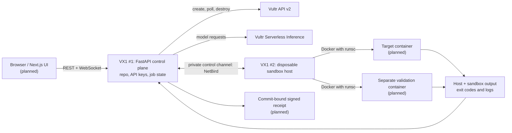

# Cerberus


Cerberus is a defensive repository-verification platform under construction. Its control plane will provision short-lived Vultr sandbox hosts, run repository checks inside isolated containers, collect actual execution evidence, support remediation, and repeat the checks after a change. Untrusted code must never run in the control-plane process.

## Target architecture

This diagram is the **intended** two-instance deployment, not a claim that every component is running today.



- The control plane holds both Vultr keys and the repository. Neither key goes into cloud-init, the sandbox host, or a container. Instance readiness uses a separate per-run token.
- The sandbox host is ephemeral; containers are per run. NetBird is the planned private connection between two VX1 machines. The Mac-to-VX1 smoke test used NetBird for the OpenSandbox API and a temporary callback-only HTTPS tunnel only for host readiness.
- gVisor (`runsc`) is the intended default container runtime. The VX1 bootstrap configures it and only reports ready after a restricted container returns its hostname, `uname`, and exit code.
- OpenSandbox is being evaluated for the sandbox lifecycle, **not** assumed to provide egress or credential injection under gVisor: its [secure-runtime guide](https://github.com/opensandbox-group/OpenSandbox/blob/main/docs/guides/secure-container.md) documents an incompatible egress sidecar. Network enforcement must be designed outside that sidecar.

## OpenSandbox and NetBird next steps

The OpenSandbox preflight in `sandbox_platform.py` rejects a host without `runsc` as Docker's default runtime or without a dedicated `cerberus-internal` Docker bridge marked `--internal`. That bridge must also bind published container ports to `127.0.0.1` by default. Only then does the preflight generate a fresh scoped API key, `gvisor`/`runsc`, and pinned `opensandbox/execd:v1.0.22`. The server binds to localhost for the local smoke check; the NetBird-only bind requires a connected peer and an overlay IPv4 address and passed a Mac-to-VX1 live test. The optional `--opensandbox-spike` bootstrap installs pinned `opensandbox-server==0.2.3` and Python SDK `opensandbox==0.1.16` on a disposable VX1, runs a harmless command in an OpenSandbox gVisor container, and destroys the sandbox before reporting readiness. The config deliberately does not enable OpenSandbox egress policies or Credential Vault, which are incompatible with gVisor.

**The local-only OpenSandbox/gVisor spike passed in `ord`.** The server was authenticated and bound to localhost; the SDK returned a sandbox-owned hostname, gVisor `uname`, and exit code 0. The instance was destroyed and its ID returned 404. This proves the lifecycle integration works for the smoke command, not that outbound network enforcement has been validated. Do not expose the OpenSandbox server publicly or send Vultr keys to it. The optional `--netbird-test --opensandbox-spike` path **passed live between the Mac and one disposable `ord` VX1**: a one-off ephemeral peer joined the dedicated account, OpenSandbox bound its API to the peer's NetBird IPv4, published sandbox ports were verified as loopback-only, and the Mac received a healthy response on the private address while an unauthenticated sandbox-list request was rejected. The sandbox and host were destroyed; the instance ID returned 404. The operator reports that `cerberus-control` → `cerberus-sandbox` TCP/8080 is restricted and the permissive Default policy is disabled; Cerberus has not independently audited the dashboard policy or tested the final VX1-to-VX1 link.

Each run consumes a fresh one-off key from `NETBIRD_SANDBOX_SETUP_KEY` in the ignored, owner-only local `.env`. The key is included in Vultr cloud-init user-data until the instance is deleted, even though its root-only key file is removed after enrollment. Never paste it in chat or put it in a container; remove the used key from `.env` after the run.

## Verification workflow (planned)

1. Prepare a disposable host and run a controlled repository check in a target container.
2. Evaluate the result using environment-owned evidence rather than an AI assertion; seeded exercises can use a planted, non-sensitive canary.
3. Propose a code change and retain its diff.
4. Replay the same controlled check and run the repository's tests to detect regressions.
5. Destroy temporary resources and issue a signed, replayable receipt tied to the repository commit.

## What works today

- FastAPI serves `/health`, a small logo landing page, and a token-protected `/internal/ready` callback. It now also offers token-protected job start/status/result routes and a WebSocket event stream for a read-only connectivity job. The lifecycle CLI launches a separate callback-only API without exposing the landing page or job routes through its tunnel.
- `python -m connectivity` validates inference `/models` and the **authenticated** Vultr `/account` endpoint, then lists regions. A successful public `/regions` response alone does not prove the account key is valid.
- The Vultr client can create, poll, and destroy a temporary instance; it confirms deletion via a 404. An earlier small Cloud Compute VM reached Docker readiness and was confirmed destroyed.
- **VX1/gVisor host acceptance passed live in `ord`:** the host reported CPU virtualization `svm`, a readable and writable `/dev/kvm`, and Docker default runtime `runsc`. A restricted container returned its own hostname, `4.19.0-gvisor` `uname`, and exit code 0. The instance returned 404 after deletion, and no Cerberus-tagged instances remained.
- An earlier full `ewr` VX1 stayed `pending` until timeout and was deleted. A minimal `ord` VX1 without cloud-init reached `active` quickly. This does not prove whether the earlier failure was due to region or bootstrap; no resources from either test remain.
- OpenSandbox/gVisor smoke runs passed on disposable `ord` VX1 hosts using pinned server, SDK, and execd versions. A separate live NetBird smoke run reached the authenticated API from this Mac over the private peer address; the SDK destroyed the harmless sandbox before the VM was deleted. Zero Cerberus instances remained.
- Tests cover configuration aliases, separation of keys, fail-closed VX1 plan selection, callback authentication and host-proof validation, cleanup on error paths, OpenSandbox preflight, and control-API authentication, results, and event replay.

Not yet built: the deployed VX1 control plane and its VX1-to-VX1 NetBird link, Next.js UI, sandbox-backed jobs or dynamic repository execution, persistent OpenSandbox integration, network containment enforcement, automated remediation, or signed receipts. The current job API is local and read-only; it does not provision a VM.

## Demo acceptance targets

- Show CPU virtualization, `/dev/kvm` presence and read/write access on the VX1 sandbox host. **Passed in `ord`.**
- Show real container stdout, exit code, and container-owned hostname/`uname`. **The restricted gVisor smoke container passed in `ord`; general per-job output and failure exit-code capture remain planned.**
- Show an isolation decision backed by an enforcement log, not merely an application message. **Not built.**
- Tear down containers and hosts and verify nothing remains. **VX1 deletion was confirmed via 404; the OpenSandbox smoke sandbox was destroyed by the SDK. Full job-level teardown remains planned.**

## Local setup

Requires Python 3.11 or newer.

```sh
python3 -m venv .venv
.venv/bin/pip install -r requirements.txt pytest
```

Set the account and inference keys in `.env` or your environment. The legacy `VULTR_INFERENCE_KEY` and lowercase `.env` names are also accepted. Never commit `.env` or pass keys on a command line. Restrict the local file with `chmod 600 .env`; NetBird enrollment refuses to run if it is readable by other users.

```dotenv
VULTR_API_KEY=your-account-token
VULTR_INFERENCE_API_KEY=your-inference-token
OPENAI_BASE_URL=https://api.vultrinference.com/v1
OPENAI_API_KEY=${VULTR_INFERENCE_API_KEY}
VULTR_REGION=ord
VULTR_PLAN=vx1-g-2c-8g-120s
```

The OpenAI-compatible variables are reserved for later SDK calls; the current connectivity check uses the inference key directly. Select a tool-calling model from the live `/models` response when that integration is built rather than hard-coding a deck example: Kimi-K2.6 was not in the returned list at the last check.

```sh
.venv/bin/uvicorn main:app --host 127.0.0.1 --port 8000
.venv/bin/python -m connectivity
.venv/bin/python -m pytest -q
```

`GET /` displays the Cerberus logo, and `GET /logo.jpg` serves the image for future clients. `GET /health` returns `{"status": "ok"}`. The connectivity command fetches `/v1/models`, verifies account-key access with `/v2/account`, and fetches `/v2/regions` before printing the successful statuses and available model IDs.

## Local control API

Set a separate `CERBERUS_CONTROL_TOKEN` of at least 32 random characters in the ignored, owner-only `.env`. Generate one locally with Python's `secrets.token_urlsafe(32)` and copy it using your editor; never reuse a Vultr key, commit the token, or embed it in a public frontend. Until it is configured, job endpoints return 503. REST calls require `Authorization: Bearer <control token>`.

- `POST /jobs` with `{"type":"connectivity"}` returns 202 and a job ID. This is the only supported job type and performs read-only `/models`, `/account`, and `/regions` checks from the control process; it never runs repository code or creates instances.
- `GET /jobs/{id}` reports `queued`, `running`, `completed`, or `failed`. `GET /jobs/{id}/result` returns 202 while pending, a successful model list and region count when complete, or a generic 502 on upstream failure. Upstream errors and tokens are not returned to clients.
- `WS /jobs/{id}/events` replays earlier events and streams new ones. Authenticate with the **first WebSocket JSON message** `{"token":"<control token>"}`, not a URL query parameter. Use WSS if deployed remotely.

Jobs and events are bounded and held **in memory only**: a process restart loses them, and this prototype is intended for one trusted local controller process. A public browser UI needs proper session authentication before it can safely use these endpoints.

## Persistent control-plane VX1 (prepared, not deployed)

`control_plane.py` prepares a separate Ubuntu 24.04 VX1 in `ord` for the **control plane**, not for sandbox execution. Its bootstrap contains only a one-off, non-ephemeral NetBird key and a scoped readiness token; it never contains either Vultr key or the API control token. It enrolls with a one-off key intended for `cerberus-control` (check its dashboard auto-group), attempts to mask the public OS SSH service and socket, enables NetBird SSH/SFTP with user authentication and root login disabled, clones a specific pushed repository commit, installs the pinned Python requirements, and prepares a non-root systemd service that binds only to its own NetBird address. The service does not start until an owner-only credentials file has arrived. This path is **not yet live-verified**.

After a successful bootstrap, the provisioning path replaces Vultr user-data with a harmless script and verifies the replacement, so the used NetBird enrollment key is no longer retained there. It keeps a healthy control-plane VM running; a failed bootstrap is set to destroy its own VM. This is a **persistent billable server**, unlike the temporary sandbox host, and requires separate approval before provisioning.

A private-transfer helper is prepared to send only `VULTR_API_KEY`, `VULTR_INFERENCE_API_KEY`, and a distinct `CERBERUS_CONTROL_TOKEN` from the owner's Mac to the VM's restricted `cerberus` account via NetBird SSH standard input, not shell arguments. It has not yet been exercised against a live control VM. Before deployment, create a fresh **one-off, non-ephemeral** `cerberus-control` NetBird setup key, store it only as `NETBIRD_CONTROL_SETUP_KEY` in the ignored `.env`, and generate a separate random `CERBERUS_CONTROL_TOKEN` there. Configure a narrow operator-to-control NetBird SSH policy permitting the `cerberus` OS user and TCP/8000 for the private API. Once the VM exists, add **its specific public IP as a /32** to the Vultr account API access list before running account-authenticated jobs from it; do not allow all IPs. Never paste these keys into chat. Commit and push the intended code before provisioning; the CLI checks that the local main commit matches GitHub.

## Temporary instance check

The lifecycle command provisions one Ubuntu 24.04 VX1 instance with local NVMe, checks CPU virtualization and read/write access to `/dev/kvm`, installs Docker and gVisor via cloud-init, sets `runsc` as Docker's default runtime, and runs a read-only, networkless gVisor smoke container that reports its actual hostname, `uname`, and exit code with the host checks before sending the readiness callback. It deletes the instance even if readiness fails after the API returns an ID, confirming deletion with a 404. Neither Vultr key is included in cloud-init; the callback uses a separate, short-lived token.

Provide a publicly reachable HTTPS URL that forwards `/internal/ready` to port 8000 of the machine running the command. Stop any other server using that port first. The command opens a callback-only server (no home page, docs, or other API routes), and `--execute` is required because this creates a billable VM and deletes it afterward:

```sh
.venv/bin/python -m instance_lifecycle --callback-url https://YOUR-HTTPS-HOST/internal/ready --region ord --plan vx1-g-2c-8g-120s --execute
```

To repeat the local-only OpenSandbox smoke check on a newly approved temporary VX1, add `--opensandbox-spike` before `--execute`. This generates a separate scoped API key on the host and stores it only in a root-owned file on the throwaway VM; it never uses the Vultr API or inference key for the OpenSandbox server. For the Mac-to-VX1 private-peer smoke test, add both `--opensandbox-spike --netbird-test` after arranging a fresh one-off key and approving that specific VM. This path passed once in `ord`, but each new run consumes its own one-off key; remove used keys from `.env`.

The code defaults to region `ewr`, VX1 plan `vx1-g-2c-8g-120s` (with local NVMe), and OS ID `2284`, but the successful live host check used `ord`. Pass `--region ord` or set `VULTR_REGION=ord` as shown above. Override the plan with `--plan` or `VULTR_PLAN`; plans without VX1 local storage are rejected before provisioning. The application name and API title are Cerberus; this does not rename the GitHub repository or your local directory.

For this local smoke check, run `cloudflared tunnel --no-autoupdate --url http://127.0.0.1:8000` in another terminal. Append `/internal/ready` to the HTTPS URL it prints, then stop the tunnel when the check finishes. The intended two-VX1 architecture uses NetBird for the private control plane; that integration has not been built yet.
