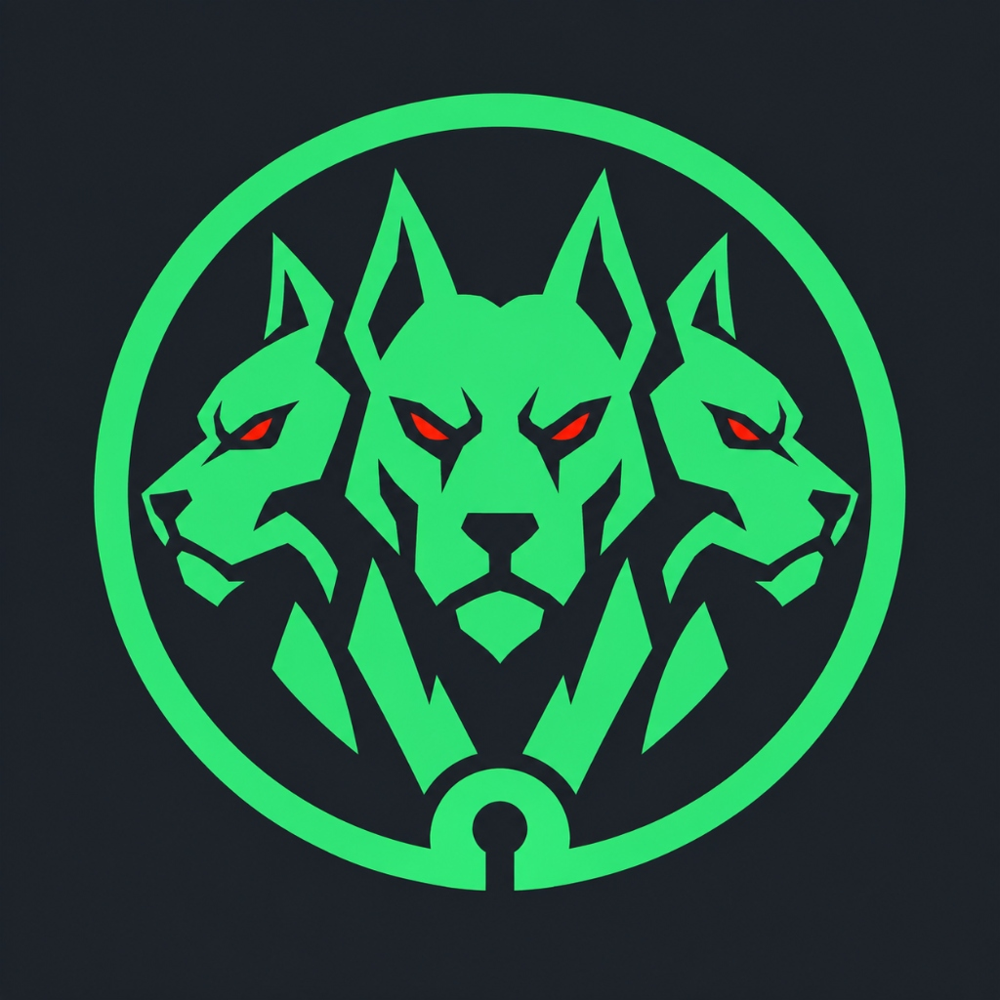
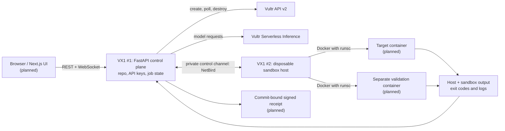

# Cerberus



Cerberus is a defensive repository-verification platform under construction. Its control plane will provision short-lived Vultr sandbox hosts, run repository checks inside isolated containers, collect actual execution evidence, support remediation, and repeat the checks after a change. Untrusted code must never run in the control-plane process.

## Target architecture

This diagram shows the **intended** two-instance deployment. The control-plane VX1 is now running; the disposable sandbox VX1, browser UI, and full verification loop are still planned.



- The control plane holds both Vultr keys and the repository. Neither key goes into cloud-init, the sandbox host, or a container. Instance readiness uses a separate per-run token.
- The sandbox host is ephemeral; containers are per run. NetBird is the planned private connection between two VX1 machines. The Mac-to-VX1 smoke test used NetBird for the OpenSandbox API and a temporary callback-only HTTPS tunnel only for host readiness.
- gVisor (`runsc`) is the intended default container runtime. The VX1 bootstrap configures it and only reports ready after a restricted container returns its hostname, `uname`, and exit code.
- OpenSandbox is being evaluated for the sandbox lifecycle, **not** assumed to provide egress or credential injection under gVisor: its [secure-runtime guide](https://github.com/opensandbox-group/OpenSandbox/blob/main/docs/guides/secure-container.md) documents an incompatible egress sidecar. Network enforcement must be designed outside that sidecar.

## OpenSandbox and NetBird next steps

The OpenSandbox preflight in `sandbox_platform.py` rejects a host without `runsc` as Docker's default runtime or without a dedicated `cerberus-internal` Docker bridge marked `--internal`. That bridge must also bind published container ports to `127.0.0.1` by default. Only then does the preflight generate a fresh scoped API key, `gvisor`/`runsc`, and pinned `opensandbox/execd:v1.0.22`. The server binds to localhost for the local smoke check; the NetBird-only bind requires a connected peer and an overlay IPv4 address and passed a Mac-to-VX1 live test. The optional `--opensandbox-spike` bootstrap installs pinned `opensandbox-server==0.2.3` and Python SDK `opensandbox==0.1.16` on a disposable VX1, runs a harmless command in an OpenSandbox gVisor container, and destroys the sandbox before reporting readiness. The config deliberately does not enable OpenSandbox egress policies or Credential Vault, which are incompatible with gVisor.

**The local-only OpenSandbox/gVisor spike passed in `ord`.** The server was authenticated and bound to localhost; the SDK returned a sandbox-owned hostname, gVisor `uname`, and exit code 0. The instance was destroyed and its ID returned 404. This proves the lifecycle integration works for the smoke command, not that outbound network enforcement has been validated. Do not expose the OpenSandbox server publicly or send Vultr keys to it. The optional `--netbird-test --opensandbox-spike` path **passed live between the Mac and one disposable `ord` VX1**: a one-off ephemeral peer joined the dedicated account, OpenSandbox bound its API to the peer's NetBird IPv4, published sandbox ports were verified as loopback-only, and the Mac received a healthy response on the private address while an unauthenticated sandbox-list request was rejected. The sandbox and host were destroyed; the instance ID returned 404. The operator reports that `cerberus-control` → `cerberus-sandbox` TCP/8080 is restricted and the permissive Default policy is disabled; Cerberus has not independently audited the dashboard policy or tested the final VX1-to-VX1 link.

Each manual spike consumes a fresh one-off key from `NETBIRD_SANDBOX_SETUP_KEY` in the ignored, owner-only local `.env`. The key is included in Vultr cloud-init user-data until the instance is deleted, even though its root-only key file is removed after enrollment. Never paste it in chat or put it in a container; remove the used key from `.env` after the run.

## Two-VX1 sandbox smoke (live verified once)

The trusted control API now has an operator-only `sandbox_smoke` job type. It is **disabled by default** and requires `CERBERUS_ENABLE_SANDBOX_JOBS=true` in the control-plane service environment, a valid control API bearer token, an explicit `approve_vm: true` request, and a **fresh one-off ephemeral** NetBird key for the `cerberus-sandbox` group. Give the key only to the trusted operator client over the private NetBird API; do not paste it in chat, embed it in public browser code, or put Vultr keys on the sandbox host. Only one sandbox VM job can be active at a time. The control VX1 was updated for one approved live smoke; the job flag was disabled afterward, and a no-key request again returned 503.

The disposable VX1 stops and verifies the public OS SSH listener before installing dependencies, then sends a per-run token-protected readiness proof to the control VX1 over NetBird TCP/8000; it never receives the Vultr keys. The control VX1 verifies the OpenSandbox API over NetBird TCP/8080, and the sandbox host uses gVisor on a dedicated internal Docker bridge. Its harmless isolation check attempts a TCP connection to the reserved TEST-NET-1 range and to the bridge gateway on a closed port; a bridge-scoped host INPUT rule logs and drops new host-bound traffic. The job requires denied command exit codes, a positive DROP counter and a **matching real kernel log line**, then reports hostname/`uname`, exit code and bounded evidence only after the sandbox and VM are destroyed. Missing enforcement evidence fails the job rather than reporting containment.

**Verified once on two `ord` VX1 peers:** the sandbox returned its own `4.19.0-gvisor` `uname` and exit code 0; the reserved-address and closed host-gateway probes both failed as required. The scoped host DROP counter increased by **2** and an actual kernel log line matched that bridge, gateway and probe port. OpenSandbox destroyed the sandbox; disposable instance `011fa7ef-5306-460e-882e-d4393824f5d9` returned 404 and zero disposable Cerberus instances remained. The persistent control VX1 continues running separately. The captured log line was:

```text
cerberus-os-drop IN=br-56c2c6d718aa OUT= MAC=d6:4b:07:61:f7:b8:a6:ce:e0:df:8f:2d:08:00 SRC=172.18.0.2 DST=172.18.0.1 LEN=60 TOS=0x00 PREC=0x00 TTL=64 ID=0 DF PROTO=TCP SPT=54345 DPT=65000 WINDOW=29184 RES=0x00 SYN URGP=0
```

This proves **that controlled host-bound probe** was blocked; it is not a general guarantee for arbitrary repositories, a signed receipt, or validation of Vultr's still-unexplained firewall-group behavior. Jobs and event history remain in memory and can disappear on control-service restart. Every new live test requires a fresh one-off ephemeral `cerberus-sandbox` key, the narrow `cerberus-sandbox` → `cerberus-control` TCP/8000 readiness policy plus control → sandbox TCP/8080, and approval for that specific billable create-and-delete action. Do not run untrusted repository code until broader containment is designed and verified.

## Broader network hardening (live attempt inconclusive)

The next disposable-host bootstrap now fails closed unless Docker reports version **26 or newer** (which includes the [internal-network DNS forwarding fix](https://github.com/moby/moby/discussions/47601)), gVisor is the default runtime, the dedicated bridge is internal with **IPv6 disabled** and all published ports bind to localhost. Host `iptables` guards scoped to that bridge cover new host-bound IPv4 connections and IPv4 forwarding away from the bridge; `ip6tables` guards cover IPv6 host-bound and forwarded packets. The sandbox smoke also requires `nslookup example.com` to fail and verifies **exactly one** running container on the dedicated bridge. The guard is installed before sandbox creation, and the cloud-init payload remains bounded below a conservative 16 KiB test budget.

**A live attempt did not produce a containment result.** One approved disposable `ord` VX1 became active, but no readiness proof arrived; the job failed and the same instance (`be85ec2d-14dc-4a55-bb22-4778c1126c7b`) was confirmed deleted by 404 with zero disposable Cerberus VMs remaining. Its guest logs were lost at teardown, so the exact bootstrap failure is **unknown**. The earlier successful kernel log still proves only the controlled IPv4 host-gateway drop; this failed attempt verifies neither DNS denial nor the new IPv4 FORWARD or IPv6 guards. A Docker `--internal` bridge also permits traffic among containers on that same bridge; this prototype refuses a second container rather than claiming lateral isolation.

To make a future failure diagnosable without transmitting secrets, the new private `/internal/failed` callback accepts only a registered per-run token, a fixed bootstrap-stage name and an exit code. It can report failures after NetBird enrollment; failures before that connection still time out. This diagnostic path is **offline-tested, not live-verified**, and is not yet deployed on the persistent control VX1. A new disposable run would need fresh code deployment, a fresh one-off key and separate approval. Do not run untrusted repositories until the remaining containment paths are validated; do not treat the Vultr firewall-group anomaly as an isolation layer.

## Verification workflow (planned)

1. Prepare a disposable host and run a controlled repository check in a target container.
2. Evaluate the result using environment-owned evidence rather than an AI assertion; seeded exercises can use a planted, non-sensitive canary.
3. Propose a code change and retain its diff.
4. Replay the same controlled check and run the repository's tests to detect regressions.
5. Destroy temporary resources and issue a signed, replayable receipt tied to the repository commit.

## What works today

- FastAPI serves `/health`, a small logo landing page, and a token-protected `/internal/ready` callback. It now also offers token-protected job start/status/result routes and a WebSocket event stream for a read-only connectivity job. The lifecycle CLI launches a separate callback-only API without exposing the landing page or job routes through its tunnel.
- `python -m connectivity` validates inference `/models` and the **authenticated** Vultr `/account` endpoint, then lists regions. A successful public `/regions` response alone does not prove the account key is valid.
- The Vultr client can create, poll, and destroy a temporary instance; it confirms deletion via a 404. An earlier small Cloud Compute VM reached Docker readiness and was confirmed destroyed.
- **VX1/gVisor host acceptance passed live in `ord`:** the host reported CPU virtualization `svm`, a readable and writable `/dev/kvm`, and Docker default runtime `runsc`. A restricted container returned its own hostname, `4.19.0-gvisor` `uname`, and exit code 0. The instance returned 404 after deletion, and no Cerberus-tagged instances remained.
- An earlier full `ewr` VX1 stayed `pending` until timeout and was deleted. A minimal `ord` VX1 without cloud-init reached `active` quickly. This does not prove whether the earlier failure was due to region or bootstrap; no resources from either test remain.
- OpenSandbox/gVisor smoke runs passed on disposable `ord` VX1 hosts using pinned server, SDK, and execd versions. A separate live NetBird smoke run reached the authenticated API from this Mac over the private peer address; the SDK destroyed the harmless sandbox before the VM was deleted. No disposable sandbox instance remains; the persistent control-plane VX1 is running separately.
- The control-plane VX1 serves FastAPI only on NetBird. A private health check, authenticated read-only connectivity job and WebSocket events passed live; an approved two-VX1 sandbox smoke also returned gVisor output, a host DROP counter and a matching kernel log before verified teardown. The control VM stays billable until explicitly destroyed.
- Tests cover configuration aliases, separation of keys, fail-closed VX1 plan selection, callback authentication and host-proof validation, cleanup on error paths, OpenSandbox preflight, and control-API authentication, results, and event replay.

Not yet built: repeatable repository execution, wider outbound containment beyond the controlled network probes, Next.js UI, a durable job store, automated remediation and signed receipts. The deployed API supports the operator-approved sandbox smoke, but not arbitrary repositories or the prove-then-patch loop.

## Demo acceptance targets

- Show CPU virtualization, `/dev/kvm` presence and read/write access on the VX1 sandbox host. **Passed in `ord`.**
- Show real container stdout, exit code, and container-owned hostname/`uname`. **The restricted gVisor smoke container passed in `ord`; general per-job output and failure exit-code capture remain planned.**
- Show an isolation decision backed by an enforcement log, not merely an application message. **One controlled host-gateway probe produced a live bridge-scoped DROP counter and matching kernel log; broad egress enforcement remains unverified.**
- Tear down temporary containers and sandbox hosts and verify none remain. **Disposable VX1 deletion was confirmed via 404 and the smoke sandbox was destroyed by the SDK. The persistent control VX1 intentionally remains running; full job-level teardown is planned.**

## Local setup

Requires Python 3.11 or newer.

```sh
python3 -m venv .venv
.venv/bin/pip install -r requirements.txt pytest
```

Set the account and inference keys in `.env` or your environment. The legacy `VULTR_INFERENCE_KEY` and lowercase `.env` names are also accepted. Never commit `.env` or pass keys on a command line. Restrict the local file with `chmod 600 .env`; NetBird enrollment refuses to run if it is readable by other users.

```dotenv
VULTR_API_KEY=your-account-token
VULTR_INFERENCE_API_KEY=your-inference-token
OPENAI_BASE_URL=https://api.vultrinference.com/v1
OPENAI_API_KEY=${VULTR_INFERENCE_API_KEY}
VULTR_REGION=ord
VULTR_PLAN=vx1-g-2c-8g-120s
```

The OpenAI-compatible variables are reserved for later SDK calls; the current connectivity check uses the inference key directly. Select a tool-calling model from the live `/models` response when that integration is built rather than hard-coding a deck example: Kimi-K2.6 was not in the returned list at the last check.

```sh
.venv/bin/uvicorn main:app --host 127.0.0.1 --port 8000
.venv/bin/python -m connectivity
.venv/bin/python -m pytest -q
```

`GET /` displays the Cerberus logo, and `GET /logo.jpg` serves the image for future clients. `GET /health` returns `{"status": "ok"}`. The connectivity command fetches `/v1/models`, verifies account-key access with `/v2/account`, and fetches `/v2/regions` before printing the successful statuses and available model IDs.

## Local control API

Set a separate `CERBERUS_CONTROL_TOKEN` of at least 32 random characters in the ignored, owner-only `.env`. Generate one locally with Python's `secrets.token_urlsafe(32)` and copy it using your editor; never reuse a Vultr key, commit the token, or embed it in a public frontend. Until it is configured, job endpoints return 503. REST calls require `Authorization: Bearer <control token>`.

- `POST /jobs` with `{"type":"connectivity"}` returns 202 and a job ID. This is the only supported job type and performs read-only `/models`, `/account`, and `/regions` checks from the control process; it never runs repository code or creates instances.
- `GET /jobs/{id}` reports `queued`, `running`, `completed`, or `failed`. `GET /jobs/{id}/result` returns 202 while pending, a successful model list and region count when complete, or a generic 502 on upstream failure. Upstream errors and tokens are not returned to clients.
- `WS /jobs/{id}/events` replays earlier events and streams new ones. Authenticate with the **first WebSocket JSON message** `{"token":"<control token>"}`, not a URL query parameter. Use WSS if deployed remotely.

Jobs and events are bounded and held **in memory only**: a process restart loses them, and this prototype runs in a single trusted controller process, locally or on the private VX1. A public browser UI needs proper session authentication before it can safely use these endpoints.

## Persistent control-plane VX1 (live)

`control_plane.py` provisioned one persistent Ubuntu 24.04 VX1 in `ord` from a pinned pushed commit. Cloud-init carried only a one-off NetBird control-peer key and scoped readiness token, **never** either Vultr key or the API control token. The provisioning path replaced and verified the one-off-key user-data afterward. The account key, inference key, and a distinct `CERBERUS_CONTROL_TOKEN` were transferred through authenticated NetBird SSH standard input into an owner-only `600` file for the non-root `cerberus` service. The FastAPI service binds only to its verified NetBird IPv4.

**Verified live:** Private `/health` returned 200; an unauthenticated job start returned 401; an authenticated read-only connectivity job checked inference models, the protected Vultr account, and regions and returned 200. Its WebSocket replay delivered `queued → running → completed`. Public IPv4 TCP/22, TCP/22022, and TCP/8000 were unreachable in external checks. Vultr API access from the control VM required adding only that VM's public IPv4 as a `/32` to the account allowlist. This one control VX1 remains **running and billable** (the plan was listed at $0.076/hour); there is no deployed disposable sandbox peer alongside it yet.

**Security and rollout limitations:** During the live bootstrap, masking `ssh.service` did not stop the already-running public OpenSSH listener; it was stopped manually in the Vultr Console. A Vultr firewall group with zero inbound rules was linked to the VM but did **not** block public port 22 while OpenSSH was running, contrary to the documented default-deny behavior. Do not rely on that group for containment until Vultr explains or fixes the discrepancy. The enrollment script also left a restrictive shell `umask` that made the root-owned code and venv inaccessible to the non-root service; permissions were repaired on the VM. Minimal Uvicorn lacked WebSocket support, so `websockets==15.0.1` was installed on the VM. The updated repository bootstrap now stops and checks OS SSH early, restores the previous `umask`, creates API-key files with a restrictive `umask`, and pins the WebSocket dependency; **these source fixes have not been rolled out to the already-running VM**, which was repaired separately.

For a future replacement VM, commit and push the intended code first, create a fresh one-off **non-ephemeral** `cerberus-control` setup key and configure the limited NetBird SSH and TCP/8000 operator policies before enrollment. Remove the **used** `NETBIRD_CONTROL_SETUP_KEY` from the Mac's ignored `.env`; it cannot enroll another peer. Never paste credentials in chat or user-data. Destroying the persistent VX1 later requires separate approval and removes its local NVMe.

## Temporary instance check

The lifecycle command provisions one Ubuntu 24.04 VX1 instance with local NVMe, checks CPU virtualization and read/write access to `/dev/kvm`, installs Docker and gVisor via cloud-init, sets `runsc` as Docker's default runtime, and runs a read-only, networkless gVisor smoke container that reports its actual hostname, `uname`, and exit code with the host checks before sending the readiness callback. It deletes the instance even if readiness fails after the API returns an ID, confirming deletion with a 404. Neither Vultr key is included in cloud-init; the callback uses a separate, short-lived token.

Provide a publicly reachable HTTPS URL that forwards `/internal/ready` to port 8000 of the machine running the command. Stop any other server using that port first. The command opens a callback-only server (no home page, docs, or other API routes), and `--execute` is required because this creates a billable VM and deletes it afterward:

```sh
.venv/bin/python -m instance_lifecycle --callback-url https://YOUR-HTTPS-HOST/internal/ready --region ord --plan vx1-g-2c-8g-120s --execute
```

To repeat the local-only OpenSandbox smoke check on a newly approved temporary VX1, add `--opensandbox-spike` before `--execute`. This generates a separate scoped API key on the host and stores it only in a root-owned file on the throwaway VM; it never uses the Vultr API or inference key for the OpenSandbox server. For the Mac-to-VX1 private-peer smoke test, add both `--opensandbox-spike --netbird-test` after arranging a fresh one-off key and approving that specific VM. This path passed once in `ord`, but each new run consumes its own one-off key; remove used keys from `.env`.

The code defaults to region `ewr`, VX1 plan `vx1-g-2c-8g-120s` (with local NVMe), and OS ID `2284`, but the successful live host check used `ord`. Pass `--region ord` or set `VULTR_REGION=ord` as shown above. Override the plan with `--plan` or `VULTR_PLAN`; plans without VX1 local storage are rejected before provisioning. The application name and API title are Cerberus; this does not rename the GitHub repository or your local directory.

For this local smoke check, run `cloudflared tunnel --no-autoupdate --url http://127.0.0.1:8000` in another terminal. Append `/internal/ready` to the HTTPS URL it prints, then stop the tunnel when the check finishes. The intended two-VX1 architecture uses NetBird for the private control plane; that integration has not been built yet.
