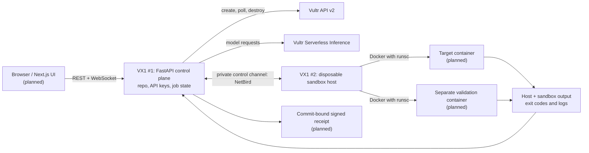

# Cerberus


Cerberus is a defensive repository-verification platform under construction. Its control plane will provision short-lived Vultr sandbox hosts, run repository checks inside isolated containers, collect actual execution evidence, support remediation, and repeat the checks after a change. Untrusted code must never run in the control-plane process.

## Target architecture

This diagram is the **intended** two-instance deployment, not a claim that every component is running today.



- The control plane holds both Vultr keys and the repository. Neither key goes into cloud-init, the sandbox host, or a container. Instance readiness uses a separate per-run token.
- The sandbox host is ephemeral; containers are per run. NetBird is the planned private connection between the two VX1 machines. The current local smoke test instead uses a temporary callback-only HTTPS tunnel.
- gVisor (`runsc`) is the intended default container runtime. The VX1 bootstrap configures it and only reports ready after a restricted container returns its hostname, `uname`, and exit code.
- OpenSandbox is being evaluated for the sandbox lifecycle, **not** assumed to provide egress or credential injection under gVisor: its [secure-runtime guide](https://github.com/opensandbox-group/OpenSandbox/blob/main/docs/guides/secure-container.md) documents an incompatible egress sidecar. Network enforcement must be designed outside that sidecar.

## Verification workflow (planned)

1. Prepare a disposable host and run a controlled repository check in a target container.
2. Evaluate the result using environment-owned evidence rather than an AI assertion; seeded exercises can use a planted, non-sensitive canary.
3. Propose a code change and retain its diff.
4. Replay the same controlled check and run the repository's tests to detect regressions.
5. Destroy temporary resources and issue a signed, replayable receipt tied to the repository commit.

## What works today

- FastAPI serves `/health`, a small logo landing page, and a token-protected `/internal/ready` callback. The lifecycle CLI launches a callback-only API without exposing the landing page or API docs through its tunnel.
- `python -m connectivity` validates inference `/models` and the **authenticated** Vultr `/account` endpoint, then lists regions. A successful public `/regions` response alone does not prove the account key is valid.
- The Vultr client can create, poll, and destroy a temporary instance; it confirms deletion via a 404. An earlier small Cloud Compute VM reached Docker readiness and was confirmed destroyed.
- VX1/gVisor host-check code and mocked tests exist, but **live VX1 host acceptance has not passed**. The first approved VX1 was created but stayed `pending` until timeout; it was deleted, its ID returned 404, and the account had zero Cerberus-tagged instances afterward. No `/dev/kvm` or gVisor result was reported by that host.
- Tests cover configuration aliases, separation of keys, fail-closed VX1 plan selection, callback authentication and host-proof validation, and cleanup on error paths.

Not yet built: the deployed VX1 control plane, NetBird peer-to-peer link, Next.js UI, dynamic repository execution, OpenSandbox integration, network containment enforcement, automated remediation, or signed receipts. The current API does not expose job-start or WebSocket status endpoints.

## Demo acceptance targets

- Show CPU virtualization, `/dev/kvm` presence and read/write access on the VX1 sandbox host. **Pending a live VX1 host check.**
- Show real container stdout, exit code, and container-owned hostname/`uname`. **The bootstrap captures hostname/`uname` and reports zero after a successful smoke command; general exit-code capture and live VX1 proof are pending.**
- Show an isolation decision backed by an enforcement log, not merely an application message. **Not built.**
- Tear down containers and hosts and verify nothing remains. **Instance deletion and absence have been verified; container-level teardown remains planned.**

## Local setup

Requires Python 3.11 or newer.

```sh
python3 -m venv .venv
.venv/bin/pip install -r requirements.txt pytest
```

Set the account and inference keys in `.env` or your environment. The legacy `VULTR_INFERENCE_KEY` and lowercase `.env` names are also accepted. Never commit `.env` or pass keys on a command line.

```dotenv
VULTR_API_KEY=your-account-token
VULTR_INFERENCE_API_KEY=your-inference-token
OPENAI_BASE_URL=https://api.vultrinference.com/v1
OPENAI_API_KEY=${VULTR_INFERENCE_API_KEY}
VULTR_REGION=ewr
VULTR_PLAN=vx1-g-2c-8g-120s
```

The OpenAI-compatible variables are reserved for later SDK calls; the current connectivity check uses the inference key directly. Select a tool-calling model from the live `/models` response when that integration is built rather than hard-coding a deck example: Kimi-K2.6 was not in the returned list at the last check.

```sh
.venv/bin/uvicorn main:app --host 127.0.0.1 --port 8000
.venv/bin/python -m connectivity
.venv/bin/python -m pytest -q
```

`GET /` displays the Cerberus logo, and `GET /logo.jpg` serves the image for future clients. `GET /health` returns `{"status": "ok"}`. The connectivity command fetches `/v1/models`, verifies account-key access with `/v2/account`, and fetches `/v2/regions` before printing the successful statuses and available model IDs.

## Temporary instance check

The lifecycle command provisions one Ubuntu 24.04 VX1 instance with local NVMe, checks CPU virtualization and read/write access to `/dev/kvm`, installs Docker and gVisor via cloud-init, sets `runsc` as Docker's default runtime, and runs a read-only, networkless gVisor smoke container that reports its actual hostname, `uname`, and exit code with the host checks before sending the readiness callback. It deletes the instance even if readiness fails after the API returns an ID, confirming deletion with a 404. Neither Vultr key is included in cloud-init; the callback uses a separate, short-lived token.

Provide a publicly reachable HTTPS URL that forwards `/internal/ready` to port 8000 of the machine running the command. Stop any other server using that port first. The command opens a callback-only server (no home page, docs, or other API routes), and `--execute` is required because this creates a billable VM and deletes it afterward:

```sh
.venv/bin/python -m instance_lifecycle --callback-url https://YOUR-HTTPS-HOST/internal/ready --execute
```

The default region is `ewr`, VX1 plan `vx1-g-2c-8g-120s` (with local NVMe), and OS ID `2284`. Override region and plan via `VULTR_REGION` and `VULTR_PLAN` in `.env` or use `--region` and `--plan`. Plans without VX1 local storage are rejected before provisioning. The application name and API title are Cerberus; this does not rename the GitHub repository or your local directory.

For this local smoke check, run `cloudflared tunnel --no-autoupdate --url http://127.0.0.1:8000` in another terminal. Append `/internal/ready` to the HTTPS URL it prints, then stop the tunnel when the check finishes. The intended two-VX1 architecture uses NetBird for the private control plane; that integration has not been built yet.
